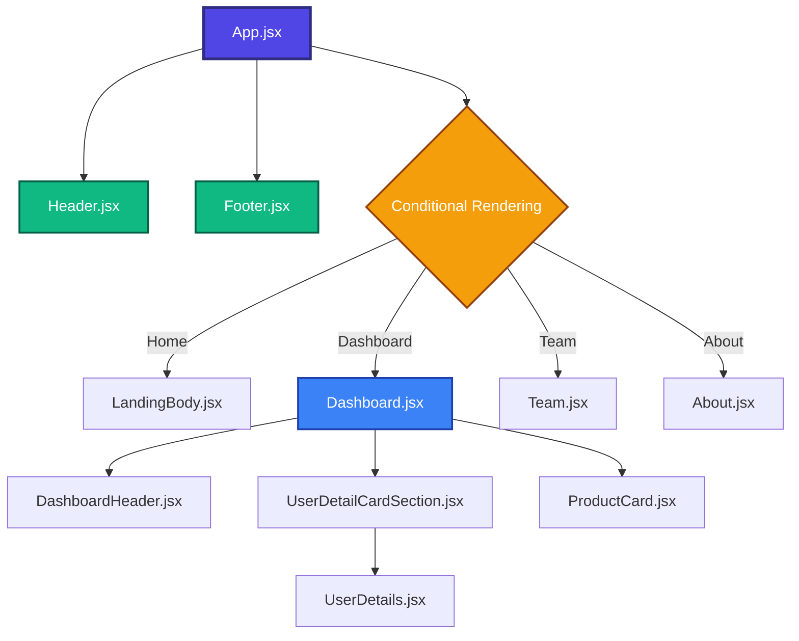

# UrbanNex - Responsive E-commerce landing page

A modern, responsive ecommerce landing page built with React, Vite, and Tailwind CSS. This project demonstrates conditional rendering, component-based architecture, and responsive design principles.

---

## 🚀 Features

- **Responsive Navigation**: Fully responsive navbar with mobile hamburger menu
- **Conditional Rendering**: Dynamic page switching without page reload
- **Multiple Pages**: 
  - Home (Landing Page)
  - Dashboard with user details and product cards
  - Team page
  - About page
- **Consistent Layout**: Persistent header and footer across all pages
- **Modern UI**: Built with Tailwind CSS for sleek, contemporary design
- **Mobile-First**: Optimized for all screen sizes

---

## 🛠️ Tech Stack

---

## 📁 Component Structure

### Component Flow Explanation
- **App.jsx** is the root component (purple box)
- **Header & Footer** (green boxes) are always visible across all pages
- **Conditional Rendering** (orange diamond) switches between different pages based on navbar selection
- **Dashboard.jsx** (blue box) is the most complex page with 3 child components
- **UserDetailCardSection.jsx** further imports **UserDetails.jsx**

---

## 🎯 Key Learning Points

- React component composition and reusability
- React States, Events, Props
- Conditional rendering for SPA navigation
- Responsive design with Tailwind CSS
- Mobile-first approach with hamburger menu
- Component-based architecture

---

## 🔮 Future Enhancements

- Add routing with React Router
- Implement shopping cart functionality
- Add product filtering and search
- Integrate with backend API
- User Authentication with security
- Add animations and transitions

---

## 👤 Author

Abinash Dash
- GitHub: [@AbiDev2003](https://github.com/AbiDev2003)
- LinkedIn: [Abinash Dash](https://linkedin.com/in/abinashDev)

---

## 🔗 Live Link
- Website Link: [urbannex.vercel.app](https://urbannex.vercel.app/)

---

⭐ Let's connect and grow together. Feel free to give feedbacks !
